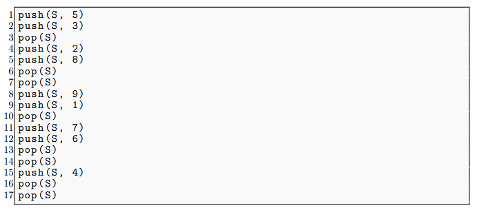
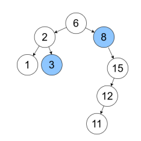

# Estruturas de Dados em C

Este repositório contém implementações em C de três estruturas de dados fundamentais: **lista sequencial estática**, **pilha estática**, **pilha dinâmica** e **fila estática circular**.

## Sumário

- [Lista Sequencial Estática](#lista-sequencial-estática)

- [Pilha Estática](#pilha-estática)

- [Pilha Dinâmica](#pilha-dinâmica)

- [Fila Estática Circular](#fila-estática-circular)
## Lista Sequencial Estática

A **Lista Sequencial Estática** é implementada utilizando um array estático. Nesta implementação, os elementos são armazenados em posições contíguas na memória, o que proporciona um acesso eficiente, especialmente em situações onde a lista é percorrida sequencialmente.

### Estrutura

#### `Lista`

A estrutura da lista sequencial contém:
- `data[]`: array que armazena os elementos da lista.
- `capacity`: a capacidade máxima da lista.
- `last`: o índice do último elemento da lista.

### Operações básicas:
- **Inserção:** insere elementos em posições específicas (início, meio ou fim).
- **Remoção:** remove elementos de uma posição especifica e ajusta o restante da lista para manter a sequencia.
- **Busca:** procura por um elemento em especifico, pode envolver percorrer a lista toda.
- **Acesso:** Permite acessar qualquer elemento da lista com o indice

### Características

- **Inserção**: Se a lista não estiver cheia, elementos posteriores são deslocados à direita para abrir espaço para o novo elemento. Se estiver cheia, ocorre overflow.
- **Exclusão**: Após a exclusão de um elemento, todos os itens à direita são deslocados para a esquerda, preenchendo o espaço vazio.
- **Busca**: A busca sequencial é utilizada, dado que a lista não é necessariamente ordenada.

### Complexidade:
- **Inserção:** O(1) se inserir no final, O(n) se for necessário deslocar elementos, ou seja, no inicio ou ordenada. Nesse caso o pior caso é o inicio
- **Remoção:** O(1) para remover o elemento final e O(n) para remover elementos de outra posição (nesse caso o inicio)
- **Busca:** O(1), acesso é direto via índice.
- **Acesso:** O(n), pois é necessário percorrer os elementos até encontar o desejado. Com a **busca sequencial**

### Questões:

#### 1. Considere Q uma fila estática de tamanho 4. indique os elementos finais, as posições dentro do array e o front e rear


---
## Lista Encadeada
a **lista encadeada** é uma estrutura de dados onde os elementos (nós) são armazenados de forma **não continua** na memória e estão conectados uns aos outros por ponteiros

### Tipos de listas encadeadas:

### Lista Simplesmente Encadeada:
Cada nó contém dois campos, o valor do elemento e um ponteiro que aponta para o próximo nó da lista

#### Caracteristicas:
- **Crescimento dinâmico:** O tamanho da lista pode aumentar ou diminuir dinamicamente à medida que elementos são adicionados ou removidos
- **Acesso sequencial:** Não há uma forma de acesso direto, é necessário percorrer toda a lista para encontar o nó desejado (O(n)).

#### Operações:
*  **Inserção no ínicio:** O(1)
*  **Inserção no final ou em uma posição especifica:** O(n)
*  **Remoção no ínicio:** O(1)
*  **Remoção no final ou em uma posição especifica:** O(n)

Se comporta de forma parecida com a sequencial estática, mas o tamanho é variável, porem devido ao uso de ponteiros ocupa mais armazenamento 

### Lista Duplamente Encadeada:
Ela se diferencia da lista simplismente encadeada por ter um acesso bidirecional, ou seja, podemos percorrer


### Lista Encadeada Circular
A **lista encadeada circular** é uma variação onde o último nó aponta para o primeiro formando um ciclo. Isso permite que ela seja percorrida continuamente e pode ser útil em várias aplicações, como em jogos, **escalonamento de tarefas** e manipulação de buffers.

#### Caracteristicas
- **Circularidade:** o ultimo nó aponta para o primeiro, permitindo percorrer a lista idnefinidamente sem chegar a um final.
- **Inserções e remoções mais eficientes:** não há necessidade de manipular ponteiros de maneira especial, se tornando mais eficiente que não circulares
- **Acesso sequencial:** para acessar um nó especifico é necessário percorrer a lista a partir de um nó inicial (menos eficiente que nas outras)

#### Estrutura do nó
- **Dado:** o valor que o nó armazena
- **Ponteiro para o próximo nó (prev ou prox):** um ponteiro que aponta para o próximo nó

#### Operações
É semelhante as operações da lista simplismente (e duplamente) ligadas, com a diferença de que pode voltar ao início sem precisar reiniciar o processo de navegação

- **Inserção no ínicio:** é preciso percorrer toda a lista para chegar ao final que aponta para o inicio, ou seja, sua complexidade é O(n).
- **Inserção final:** é preciso percorrer toda a lista para encontrar o elemento anterior ao final, ou seja, sua complexidade é O(n).
- **Inserção ordenada:** é preciso procurar o ponto de inserção que pode ser no inicio, meio ou fim, nesse caso a complexidade do pior caso é O(n) (inserindo no inicio ou final).
- **Remoção no ínicio:** é preciso percorrer toda a lista para chegar ao final que aponta para o inicio, ou seja, sua complexidade é O(n).
- **Remoção final:** é preciso percorrer toda a lista para encontrar o elemento anterior ao final, ou seja, sua complexidade é O(n).
- **Remoção ordenada:** é preciso procurar o ponto de remoção que pode ser no inicio, meio ou fim, nesse caso a complexidade do pior caso é O(n) (inserindo no inicio ou final).

#### Questões

##### 1) Considere que Q seja um deque estático circular (lista duplamente encadeada circular estática )  

### Lista Duplamente Encadeada

---
## Pilha Estática
A **Pilha Estática** é implementada usando um array de valor fixom ela é baseada no conceito de LIFO "Last in, first out", ou seja, o ultimo a entrar é o primeiro a sair. **capacidade máxima** da pilha é definida no momento da criação e **não** pode ser alterada durante a execução.

### Operações básicas:
1. **Push:** Insere um elemento no topo da lista.
2. **Pop:** Remove o elemento do topo da pilha.
3. **Peek(ou Top):** retorna o elemento do topo da pilha sem remover 
4. **isFull:** Verifica se a pilha está cheia
5. **isEmpty:** Verifica se a pilha está vazia

### Complexidade: 
1. **Push:** O(1).
2. **Pop:** O(1).
3. **Peek(ou Top):** O(1).
4. **isFull:** O(1).
5. **isEmpty:** O(1).

Caso precise retirar o **primeiro elemento** da pilha essa complexidade vira O(n), pois precisaria "Desempilhar" toda a pilha para chegar no primeiro elemento 

### Questões:

#### 1. Considere que S é uma Pilha estatica de tamanho 4, faça as operações abaixo



1. 5 _ _ _
2. 5 3 _ _
3. 5 _ _ _
4. 5 2 _ _
5. 5 2 8 _
6. 5 2 _ _
7. 5 _ _ _
8. 5 9 _ _
9. 5 9 1 _
10. 5 9 _ _
11. 5 9 7 _
12. 5 9 7 6
13. 5 9 7 _
14. 5 9 _ _
15. 5 9 4 _
16. 5 9 _ _
17. 5 _ _ _

* Pilha Final: (5, 0, 0, 0)
* Não ocorreu nenhum overflow durante a execução dos comandos

---
## Pilha Dinâmica

A **Pilha Dinâmica** é implementada usando uma lista encadeada, onde cada nó contém um valor e um ponteiro para o próximo nó. Esta estrutura segue o princípio LIFO (Last In, First Out), em que o último elemento inserido é o primeiro a ser removido.

### Estrutura

#### `Node`

Cada nó da pilha contém:
- `data`: o valor armazenado no nó.
- `next`: ponteiro para o próximo nó da pilha.

#### `Pilha`

A estrutura da pilha contém:
- `top`: ponteiro para o nó no topo da pilha.
- `size`: o número de elementos armazenados na pilha.

### Operações

As operações da pilha incluem:
- Inserção (push) de um novo elemento no topo.
- Remoção (pop) do elemento no topo.
- Verificação do tamanho da pilha.
- Impressão dos elementos armazenados na pilha.
- Verificação se a pilha está vazia.

### Características

- **Inserção**: A inserção é feita no topo da pilha, tornando essa operação constante em termos de tempo (O(1)).
- **Remoção**: A remoção também ocorre no topo da pilha, sendo uma operação eficiente com tempo constante (O(1)).
- **Uso de memória**: A pilha cresce dinamicamente conforme novos elementos são inseridos, sem restrições de tamanho, até o limite da memória disponível.

---

## Fila Estática Circular

A **Fila Estática Circular** é implementada usando um array com um comportamento circular, permitindo que o início e o fim da fila sejam ajustados conforme os elementos são inseridos e removidos. Ela segue o princípio FIFO (First In, First Out), em que o primeiro elemento inserido é o primeiro a ser removido.

### Estrutura

#### `Fila`

A estrutura da fila contém:
- `data[]`: array circular que armazena os elementos.
- `capacity`: a capacidade total da fila.
- `front`: índice do início da fila.
- `rear`: índice do final da fila.
- `size`: o número de elementos atualmente na fila.

### Operações

As operações da fila incluem:
- Inserção (enqueue) de elementos no final.
- Remoção (dequeue) de elementos do início.
- Impressão dos elementos da fila.
- Verificação do número de elementos na fila.
- Verificação se a fila está vazia ou cheia.
- Limpeza da fila, removendo todos os elementos.

### Características

- **Inserção e Remoção**: Ambas as operações são realizadas em tempo constante (O(1)), desde que a fila não esteja cheia ou vazia.
- **Estrutura Circular**: A fila é circular, ou seja, o final da fila se conecta com o início, otimizando o uso de espaço.
- **Capacidade fixa**: A fila tem uma capacidade pré-definida, então pode ocorrer overflow se tentarmos inserir um elemento quando a fila está cheia.


## Arvore Binária:

### Definição e Estrutura Básica
   - Uma árvore é composta por nós, com um nó raiz e subárvores associadas.
   - Cada nó possui um pai (exceto a raiz) e pode ter filhos. Nós sem filhos são folhas.

### Características
   - Altura: profundidade máxima entre raiz e folhas.
   - Caminho: sequência entre dois nós.
   - Relações hierárquicas: ancestral e descendente.

### Tipos e Aplicações
   - Árvores binárias: cada nó tem no máximo duas subárvores (esquerda e direita).
   - Árvores binárias de busca (BST): facilitam buscas, com nós menores à esquerda e maiores à direita.
   - Usos incluem busca, inteligência artificial, análise sintática e compressão de dados.

### Operações em BST
   - Inserção: adiciona nós seguindo regras de BST.
   - Busca: verifica a presença de um elemento.
   - Remoção: depende de o nó possuir zero, um ou dois filhos.
   - - **Sem filhos:** 
   - - - Apenas remove o valor normalmente
   - - **Um filho:**
   - - - O filho assume o lugar dele
   - - **Dois filhos:**
   - - - É substituido pelo nó mais à **esquerda** da **Subarvore direita** ou pelo nó mais à **direita** da **Subarvore esquerda**
   - - - **Removendo o 6:**

   - Outros: encontrar mínimos, máximos, percursos (pré-ordem, pós-ordem, em-ordem).

### Percursos em Árvore
   - Pré-ordem: raiz → esquerda → direita.
   - Em-ordem: esquerda → raiz → direita.
   - Pós-ordem: esquerda → direita → raiz.


### Estrutura

#### Node
```c
typedef struct Node{

    int data;
    struct Node* left; // ponteiro para o nó para o lado esquerdo
    struct Node* right; // ponteiro para o nó do lado direito

} Node;
```

#### Tree
```c
typedef struct{
    Node* root; // declaração da raiz
}Tree;
```


### Implementação

#### Create Node

```c
Node* createNode(int data){
    Node* node = (Node*) malloc( sizeof(Node) );

    node->data = data;
    node->left = NULL;
    node->right = NULL;

    return node;
}
```
A aplicação é meio """trivial""", não sei oq comentar

#### Create Tree
```c
Tree* createTree(){
    Tree* tree = (Tree*) malloc( sizeof(Tree) ); // alocando memoria para a árvore

    tree->root = NULL; // apontando para a raiz
    return tree;
};
```

#### Inserir 

```c
Node* insert(Node* node, int data){

  if (node == NULL){ // caso o nó não exista

    Node* newNode = createNode(data);
    printf("\n%d", newNode->data) // printando o valor inserido na árvore
    return newNode;
  }

  // verifica se vai para o lado esquerdo
  if (data < node->data){
      node->left = insert(node->left, data);
  }
  // vai para o lado direito
  else{
      node->right = insert(node->right, data);
  }
  printf("\n%d", node->data);
  return node;

}
```

#### Detalhamento com um exemplo visual:
#### Situação Inicial
Considere a árvore abaixo, com os seguintes valores já inseridos:

```
        50
       /  \
     30    70
    / \    / \
  20  40  60  80
```

Agora, queremos inserir o valor **25**.
#### Caminho Recursivo

1. **Primeira chamada de `insert`**:
   - Nó atual: **50**
   - Comparação: `25 < 50` → o valor deve ser inserido na subárvore à esquerda.
   - Próxima chamada: `insert(node->left, 25)` com o nó **30**.

2. **Segunda chamada de `insert`**:
   - Nó atual: **30**
   - Comparação: `25 < 30` → o valor deve ser inserido na subárvore à esquerda.
   - Próxima chamada: `insert(node->left, 25)` com o nó **20**.

3. **Terceira chamada de `insert`**:
   - Nó atual: **20**
   - Comparação: `25 > 20` → o valor deve ser inserido na subárvore à direita.
   - Próxima chamada: `insert(node->right, 25)` com o nó `nullptr`.

4. **Quarta chamada de `insert`**:
   - Nó atual: `nullptr`
   - O nó é `nullptr`, então cria-se um novo nó com o valor **25** e ele é retornado.


#### Árvore Final

Após a inserção, a árvore fica assim:

```
        50
       /  \
     30    70
    / \    / \
  20  40  60  80
    \
     25
```


- - -

# Anotações do livro "Estrutura de dados descomplicada em linguagem C" do André Backes.

## 1. Introdução

### 1.1. Algoritmos

Um algoritmo pode ser definido como uma **sequência simples e objetiva** de instruções para solucionar determinado problema. Cada **instrução** indica ao computador uma ação básica a ser executada.

Um exemplo cotidiano de algoritmo seria uma receita de bolo. As instruções **devem** ser finitas e nunca ambíguas, assegurando clareza na execução. 

- **Entrada de dados:** São os dados fornecidos pelo usuário para que o algoritmo possa processá-los.
- **Processamento de dados:** São os procedimentos utilizados para transformar os dados de entrada em resultados. Eles são responsáveis por gerar os dados de saída com base nas informações recebidas.
- **Saída de dados:** São os resultados do processamento, que serão apresentados ao usuário.

Os algoritmos se diferenciam entre si pela maneira como utilizam os recursos do computador. Alguns algoritmos demandam mais tempo ou recursos do que outros, dependendo de sua eficiência.

### 1.2. Estrutura de Dados

Estruturas de dados são formas de armazenar e organizar informações de maneira que possam ser acessadas e manipuladas de modo eficiente. A escolha adequada de uma estrutura de dados é fundamental para o desempenho de um programa.

### 1.3. Alocação de Memória

#### 1.3.1. Alocação Estática

Na alocação estática, o programador não precisa se preocupar em reservar memória manualmente, pois a quantidade necessária para armazenar as variáveis é reservada automaticamente na **stack** (pilha) ou em outras seções do programa. Além disso, o programador não tem controle direto sobre o tempo de vida dessas variáveis na memória.

Nesse tipo de alocação, as variáveis são organizadas de forma sequencial na memória (por exemplo, em arrays). A memória total utilizada pelo programa é definida durante a compilação e não pode ser alterada em tempo de execução.

> [Inserir imagem do livro aqui]

#### 1.3.2. Alocação Dinâmica

Na alocação dinâmica, o programador tem controle total sobre o tamanho e o tempo de vida das variáveis. Ao contrário da alocação estática, as variáveis não são armazenadas na **stack**, mas sim na **heap**. O tempo de vida dessas variáveis é controlado manualmente e, se o programador esquecer de liberar a memória, pode ocorrer um **vazamento de memória (memory leak)**, causando problemas no sistema.

A **heap** é uma área de memória maior e mais flexível que a **stack**, sendo ideal para alocar grandes quantidades de dados ou objetos. Porém, é mais lenta. Em C, a alocação dinâmica é feita usando a função **malloc**, e a liberação da memória deve ser feita manualmente com a função **free**.

Os blocos de memória na **heap** não precisam ser contíguos, o que torna possível a criação de **estruturas encadeadas**. Essas estruturas aproveitam melhor o espaço da memória de maneira dinâmica.

> [Inserir imagem do livro aqui]

#### 1.3.3. Comparação: Alocação Estática vs Dinâmica

> [Inserir imagem comparativa do livro aqui]

---

## 2. Análise da Complexidade de Algoritmos

A complexidade computacional indica o custo de se aplicar um algoritmo, que é medido por dois principais fatores:
- **Memória:** Quanto espaço o algoritmo consome.
- **Tempo:** Quanto tempo o algoritmo leva para ser executado.

Podemos analisar a complexidade de um algoritmo de duas formas:
- **Análise empírica:** Comparação entre programas executados.
- **Análise matemática:** Estudo das propriedades teóricas do algoritmo.

### 2.1. Análise Empírica

A análise empírica avalia o custo/complexidade de um algoritmo a partir de sua execução prática. Essa abordagem tem algumas **vantagens**:
- Avaliar o desempenho do algoritmo em uma configuração específica de computador ou linguagem de programação.
- Considerar custos não aparentes, como o tempo de alocação de memória.
- Comparar a eficiência entre diferentes máquinas e linguagens.

No entanto, há algumas **desvantagens**:
- É necessário implementar o algoritmo para avaliá-lo.
- O resultado pode ser influenciado por fatores externos, como o hardware ou software utilizado.
- A natureza dos dados (reais, aleatórios ou adversos) pode afetar a avaliação do desempenho.
---Aqui está a continuação e melhoria do seu texto, com correções e explicações mais claras sobre a contagem de instruções e a análise matemática de algoritmos:

---

### 2.2. Análise Matemática

#### 2.2.1 Motivação:
Muitas vezes, é preferível realizar uma análise genérica, que funcione independentemente do hardware ou software utilizado. Nesses casos, é mais conveniente aplicar um método matemático para entender o comportamento de um algoritmo em termos de eficiência, focando no número de operações realizadas em função do tamanho da entrada, sem levar em consideração variações específicas de execução.

#### 2.2.2 Contando Instruções de um Algoritmo:
Para calcular o custo de um algoritmo, vamos examinar o código abaixo. Ele procura o maior valor presente no array `A`, contendo `n` elementos, e armazena esse valor na variável `M`:

```c
#include <stdio.h>

int main(){
  int n;
  int M = A[0];  // 1. Atribuição

  for(int i = 0; i < n; i++){  // 2. Inicialização do loop, Comparação, Incremento

    if(A[i] >= M){  // 3. Acesso ao array, Comparação
      M = A[i];  // 4. Atribuição
    }
  }
  return 0;
}
```

Neste trecho, podemos identificar as seguintes instruções:

1. **Atribuição de um valor a uma variável:** Ocorre ao inicializar `M = A[0]`, e dentro do loop quando `M = A[i]`. Atribuições simples têm um custo constante.

2. **Acesso ao valor de um elemento do array:** Em `A[i]`, acessamos um elemento do array, que também tem custo constante por ser uma operação de leitura de memória.

3. **Comparação de dois valores:** Ocorre na condição `A[i] >= M` e na verificação da condição do laço `i < n`. Comparações simples entre números possuem custo constante.

4. **Incremento de um valor:** Acontece no incremento do índice `i++`, com custo constante.

Agora, para calcular o número total de instruções:

* 1: O valor da primeira posição do array é copiado para a variável **M.** Vamos considerar que essa tarefa requer apenas **uma instrução** para acessar o valor **A[0]** e atribuí-lo à variável **M**
* 2: O laço for quando é iniciado custa **uma instrução (i = 0).** Além disso, logo após ocorre uma comparação que custará **uma instrução (i < n)**. Portanto, o custo de **cada laço** do for será de **2n instruções**, sendo n o número de repetições.
* 3 e 4: Ao final de cada iteração do laço for, vai executar **mais duas instruções.** Uma de **incremento (i++)** e uma comparação para verificar se vamos continuar no laço **for(i<n)**. Dessa forma temos a expressão final desse código

<div align="center">

1. $$f(n) = 2n + 3$$

</div>

#### 2.2.3 Custo dominante ou pior caso do algoritmo
Se desconsiderarmos os comandos no corpo do laço for, a análise do algoritmo contido no código resulta que o mesmo possui um custo de **3 + 2n Instruções.**

Mas se considerarmos que em todos os casos ele entraria no if e executaria a outra instrução de **M = A[i].** Isso complica um pouco o calculo do algoritmo

<div align="center">

2. $$A1 = {1,2,3,4}$$

</div>
<div align="center">


3. $$A2 = {4,3,2,1}$$

</div>

É fácil perceber que A1 irá precisar de mais instruções (o comando **if** é sempre **verdadeiro**) para achar o maior valor do que o array A2 (o comando if é sempre **falso**)
No algoritmo, o **pior caso** ocorre quando o array possui valores em ordem crescente. Nessa situação, o valor de **M** é sempre substituido, o que resulta em um maior número de instruções. Ou seja, no **pior caso** o for sempre **executa duas instruções**. O custo do pior caso seria:
<div align="center">


4. $$f(n) = 4n + 3$$

</div>

#### 2.2.4 Comportamento assintótico
Para analisarmos o código em diferentes linguagens podemos retirar todas as **constantes de inicialização**, ou seja, se não for afetado pelo valor de n pode ser descartado. Por exemplo:

<div align="center">

| Função de Custo   | Comportamento Assintótico               |
|-------------------------|------------|
| f(n) = 105              | f(n) = 1   |
| f(n) = 15n +2           | f(n) = n   |
| f(n) = n² + 5n + 2      | f(n) = n²  |
| f(n) = 5n³ + 200n² + 112| f(n) = n³  |

</div>

#### 2.2.5 A notação Grande-O (Big-O)
Essa notação é a forma mais conhecida e utilizada para representar o custo do algoritmo no pior caso para todas as entradas de tamanho **n.**

Podemos fazer a notação a partir do método de ordenação **selection sort**

```c
void selectionSort (int *V, int n){

  int i, j, me, troca;

  for (i = 0; i < n-1; i++){

    me = i;

    for (j = i+1; j < n; j++){

      if (V[j] < V[me]){
        me = j;
      }
    }
    if (i != me){
      temp = V[i];
      v[i] = v[me];
      v[me] = temp;
    }
  }
}
```

Para calcular o custo do selectionSort temos que calcular o resultado da soma **`1 + 2 + ... + (n-1) + n`** e podemos utilizar a formula de soma de PA para calcular

<div align= center>

5. $$S(n) = \frac{n(1 + n)}{2}$$

</div>

Temos dois laços aninhados sendo executados n vezes, ou seja, o custo do algoritmo no pior caso é **`f(n) = n²`**. Podemos falar que utilizando a notação do Big-O, esse algoritmo é **`O(n²)`**

Assim, a notação do **Grande-O** é utilizada para definir o **limite superior** do algoritmo, ou seja, nunca será mais lento que o determinado limite.

#### 2.2.6 Resumo dos tipos de análise assintótica
A **análise assintótica** é usada para descrever o comportamento de um algoritmo em termos de sua eficiência e desempenho quando o tamanho da entrada cresce. Ela permite comparar a complexidade de diferentes algoritmos, independentemente de fatores de hardware ou implementações específicas.

**1. Notação Big-O (O)**
A notação Big-O fornece um limite superior para o tempo de execução ou o consumo de memória de um algoritmo no pior caso. Ela descreve o comportamento do algoritmo à medida que a entrada cresce indefinidamente.
- Exemplo:
Para um algoritmo de busca linear:
- - Tempo de execução: O(n)

Isso significa que o tempo de execução cresce linearmente com o tamanho da entrada.

 **2. Notação Ômega (Ω)**
A notação Ômega fornece um limite inferior para o tempo de execução ou o consumo de memória de um algoritmo no melhor caso. Ela garante que o algoritmo vai levar, pelo menos, uma certa quantidade de tempo ou recursos para ser executado.

- Exemplo:
Para um algoritmo de busca binária:
- - Tempo de execução no melhor caso: Ω(1)

Isso significa que, no melhor cenário, o algoritmo pode terminar em tempo constante.

**3. Notação Teta (Θ)**
A notação Teta fornece limites tanto superior quanto inferior, significando que o algoritmo terá um comportamento de crescimento em uma taxa específica. Ela descreve o tempo de execução "exato" para grandes entradas.

- Exemplo:
Para um algoritmo de ordenação por inserção:
- - Tempo de execução: Θ(n²)

Isso indica que o tempo de execução do algoritmo é quadrático, tanto no pior quanto no melhor caso, para grandes entradas.

**4. Notação o (pequeno o)**
A notação o fornece um limite superior estrito. Ela é usada para descrever algoritmos cujo desempenho cresce mais lentamente do que um certo limite.

- Exemplo:
Se um algoritmo tem complexidade de tempo o(n²), isso significa que, para grandes entradas, ele é mais rápido que O(n²), mas não tão rápido quanto O(n).

**5. Notação ω (pequeno ômega)**
A notação ω fornece um limite inferior estrito. Ela indica que a complexidade do algoritmo cresce mais rápido que um limite específico, mas sem ser exatamente esse limite.

- Exemplo:
Se um algoritmo tem tempo ω(n), ele cresce mais rapidamente que qualquer algoritmo que seja O(n), mas sem ser limitado por O(n).

---

### Comparação Resumida

| Notação  | Descrição                              | Exemplo (Busca Linear)  |
|----------|----------------------------------------|-------------------------|
| **O**    | Limite superior (pior caso)            | O(n)                    |
| **Ω**    | Limite inferior (melhor caso)          | Ω(1)                    |
| **Θ**    | Crescimento exato (melhor e pior caso) | Θ(n)                    |
| **o**    | Limite superior estrito                | o(n²)                   |
| **ω**    | Limite inferior estrito                | ω(1)                    |

---

A análise assintótica ajuda a avaliar a eficiência dos algoritmos, permitindo uma comparação objetiva e clara sobre a escalabilidade de diferentes abordagens para problemas computacionais.
Aqui está o texto completo seguindo todas as orientações indicadas, com a documentação do código e explicações detalhadas.

## 4. Tipo Abstrato de Dados - TAD

### 4.1 Definição

- **Tipo de dados:** Define o conjunto de **valores** e **operações** que uma variável pode assumir.
  - Exemplos: `int`, `char`, `float`, `double`.
  
- **Estrutura de dados:** Consiste em um **conjunto** de tipos de dados relacionados logicamente, com algum tipo de estrutura (pode ser uma sequência lógica ou física no sistema).
  - Exemplos: `array`, `struct`, `union`, `enum`.

- **TAD (Tipo Abstrato de Dados):** Um TAD é um conjunto de dados estruturados e as operações que podem ser realizadas sobre esses dados, implementadas através de funções. Ele é puramente teórico, simplifica a descrição de algoritmos abstratos, classifica e avalia as estruturas, ocultando os dados do usuário. O TAD deve ser visto como uma "caixa preta" para o usuário, que não tem acesso direto aos dados armazenados. A implementação do TAD foca no que ele faz, não em como ele faz. Geralmente, é dividido em dois modos: **interface** e **implementação**.

#### 4.1.1 Vantagens do uso de TAD

- **Encapsulamento:** Os detalhes de implementação são ocultados, expondo apenas o que é necessário para o usuário.
- **Segurança:** Garante que os dados só possam ser manipulados através das operações permitidas.
- **Flexibilidade:** Facilita a modificação da implementação sem impactar os usuários do TAD.
- **Reutilização:** Permite a reutilização do TAD em diferentes contextos sem modificar sua implementação.

#### 4.1.2 O tipo FILE

O tipo `FILE` é uma estrutura que contém informações sobre um arquivo ou fluxo de texto. Essa estrutura é utilizada para realizar operações de entrada e saída sobre arquivos.

Em C, é recomendado que não se manipule diretamente os campos dessa estrutura, e sim que se utilize um **ponteiro** para `FILE`:

```c
FILE *f;
```

O ponteiro `f` indica onde os dados estão armazenados, mas os dados em si não podem ser acessados diretamente. Para manipulá-los, é necessário utilizar funções específicas, como:

- `fopen()` — Abre um arquivo.
- `fclose()` — Fecha um arquivo.
- `fputc()` — Escreve um caractere no arquivo.
- `fgetc()` — Lê um caractere do arquivo.
- `feof()` — Verifica se o fim do arquivo foi atingido.

Essas funções garantem a manipulação segura dos arquivos.

#### 4.1.3 O tipo opaco

Um **tipo opaco** é um tipo de dado cujo conteúdo é ocultado da interface pública. No TAD, por exemplo, a implementação dos dados é definida no arquivo `.c`, enquanto o arquivo `.h` expõe apenas a interface. Isso garante que os usuários do TAD não possam acessar diretamente os dados, apenas as operações permitidas.

#### 4.1.4 Operações básicas de um TAD

- **Criação do TAD:** Inicializa a estrutura de dados.
- **Inserção de um novo elemento no TAD:** Adiciona um elemento à estrutura.
- **Remoção de um elemento do TAD:** Remove um elemento da estrutura.
- **Acesso a um elemento do TAD:** Obtém informações sobre um elemento.
- **Destruição do TAD:** Libera os recursos alocados pela estrutura.

### 4.2 Modularizando o programa

Ao trabalhar com TADs em C, é comum modularizar o programa em dois arquivos:

- **Arquivo `.h`:** Declara os protótipos das funções, tipos de ponteiros e dados globalmente acessíveis. Define a **interface** visível para o usuário.
- **Arquivo `.c`:** Define os tipos de dados e implementa as funções. Esse arquivo contém a **implementação** oculta ao usuário.

A separação do TAD em dois arquivos é o processo de **modularização**.

### Implementando um TAD: Ponto

Agora, vamos implementar um TAD que represente um ponto no plano cartesiano, definido por suas coordenadas `x` e `y`.

#### Arquivo `Ponto.h`

```c
typedef struct ponto Ponto;

// Cria um novo ponto
Ponto* Ponto_cria(float x, float y);

// Libera um ponto
void Ponto_libera(Ponto* p);

// Acessa os valores de "x" e "y" de um ponto
int Ponto_acessa(Ponto* p, float* x, float* y);

// Atribui os valores de "x" e "y" de um ponto
int Ponto_atribui(Ponto* p, float x, float y);

// Calcula a distância entre dois pontos
float Ponto_distancia(Ponto* p1, Ponto* p2);
```

#### Arquivo `Ponto.c`

```c
#include <stdio.h>
#include <stdlib.h>
#include <math.h>
#include "Ponto.h" // Inclui os protótipos

// Definição da estrutura interna (tipo opaco)
struct ponto {
    float x; // Coordenada x do ponto
    float y; // Coordenada y do ponto
};

// Função que cria e retorna um novo ponto
Ponto* Ponto_cria(float x, float y) {
    Ponto* p = (Ponto*) malloc(sizeof(Ponto)); // Aloca memória para o ponto
    if (p != NULL) {
        p->x = x;
        p->y = y;
    }
    return p; // Retorna o ponteiro para o ponto criado
}

// Função que libera a memória alocada para um ponto
void Ponto_libera(Ponto* p) {
    free(p); // Libera a memória do ponto
}

// Função que acessa os valores das coordenadas de um ponto
int Ponto_acessa(Ponto* p, float* x, float* y) {
    if (p == NULL) return 0; // Verifica se o ponto é válido
    *x = p->x;
    *y = p->y;
    return 1; // Retorna 1 se a operação foi bem-sucedida
}

// Função que atribui novos valores às coordenadas de um ponto
int Ponto_atribui(Ponto* p, float x, float y) {
    if (p == NULL) return 0; // Verifica se o ponto é válido
    p->x = x;
    p->y = y;
    return 1; // Retorna 1 se a operação foi bem-sucedida
}

// Função que calcula a distância entre dois pontos
float Ponto_distancia(Ponto* p1, Ponto* p2) {
    if (p1 == NULL || p2 == NULL) return -1; // Verifica se os pontos são válidos
    float dx = p1->x - p2->x;
    float dy = p1->y - p2->y;
    return sqrt(dx * dx + dy * dy); // Retorna a distância euclidiana
}
```

### Função `main` para testar o TAD `Ponto`

```c
#include <stdio.h>
#include "Ponto.h" // Inclui os protótipos do TAD Ponto

int main() {
    // Criação de dois pontos
    Ponto* p1 = Ponto_cria(2.0, 3.0);
    Ponto* p2 = Ponto_cria(5.0, 7.0);

    // Acessa e imprime as coordenadas dos pontos
    float x, y;
    Ponto_acessa(p1, &x, &y);
    printf("Ponto 1: (%.2f, %.2f)\n", x, y);
    Ponto_acessa(p2, &x, &y);
    printf("Ponto 2: (%.2f, %.2f)\n", x, y);

    // Calcula e imprime a distância entre os dois pontos
    float distancia = Ponto_distancia(p1, p2);
    printf("Distância entre p1 e p2: %.2f\n", distancia);

    // Modifica as coordenadas do ponto 1
    Ponto_atribui(p1, 4.0, 6.0);
    Ponto_acessa(p1, &x, &y);
    printf("Ponto 1 atualizado: (%.2f, %.2f)\n", x, y);

    // Libera a memória dos pontos
    Ponto_libera(p1);
    Ponto_libera(p2);

    return 0;
}
```

### Explicação da função `main`:

1. **Criação dos pontos**: Usa `Ponto_cria` para inicializar dois pontos com coordenadas específicas.
2. **Acesso às coordenadas**: Usa `Ponto_acessa` para obter os valores das coordenadas dos pontos.
3. **Cálculo da distância**: Utiliza `Ponto_distancia` para calcular a distância entre os dois pontos.
4. **Modificação das coordenadas**: Usa `Ponto_atribui` para alterar as coordenadas do ponto 1.
5. **Liberação de memória**: Usa `Ponto_libera` para liberar a memória alocada